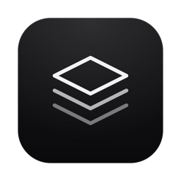
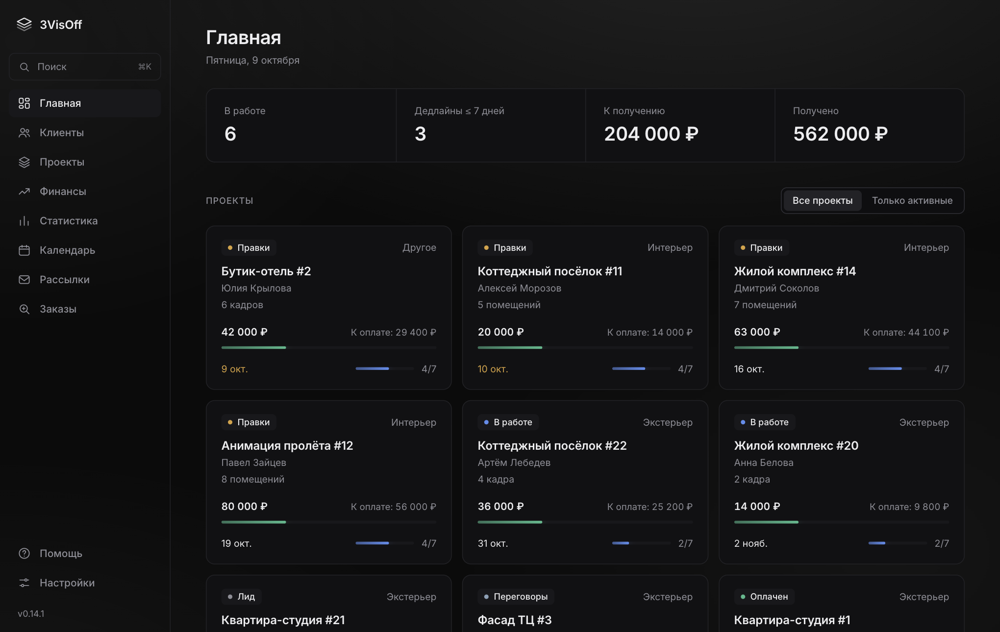
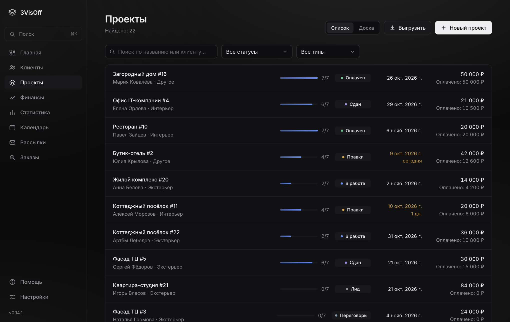
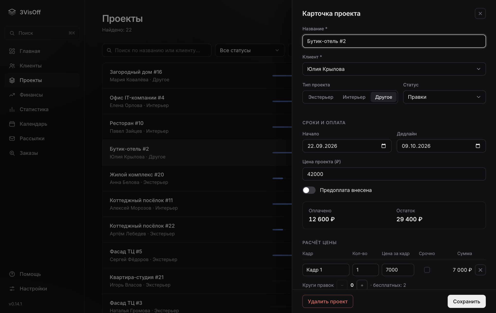
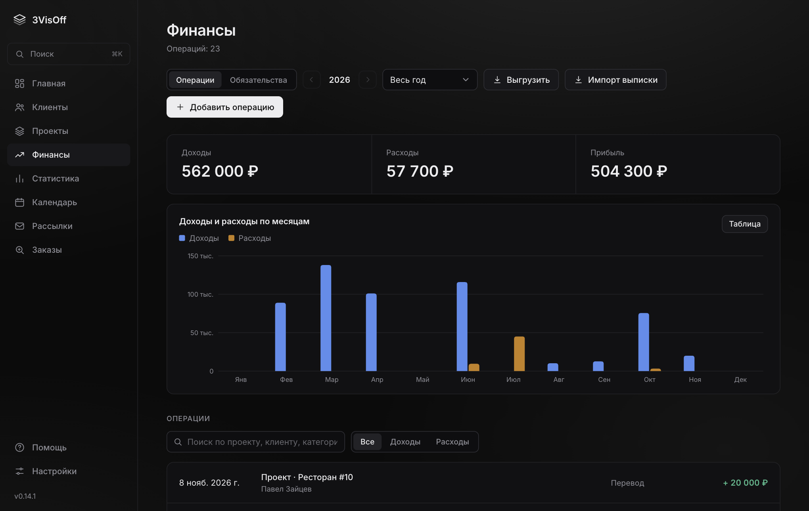
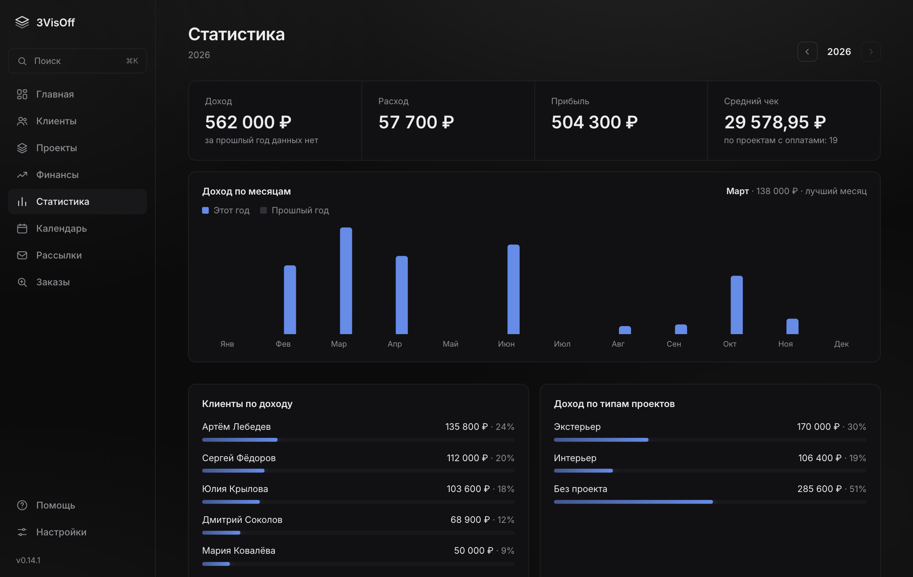
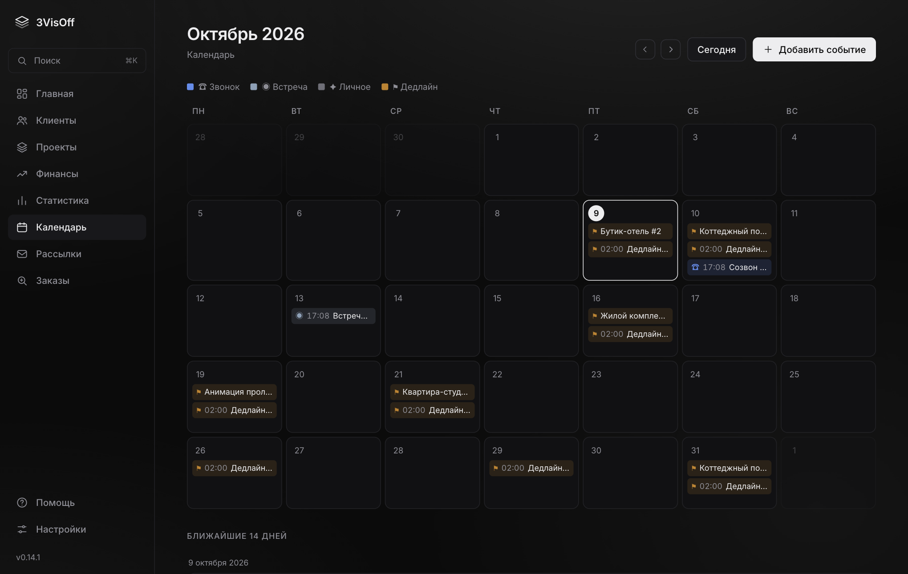
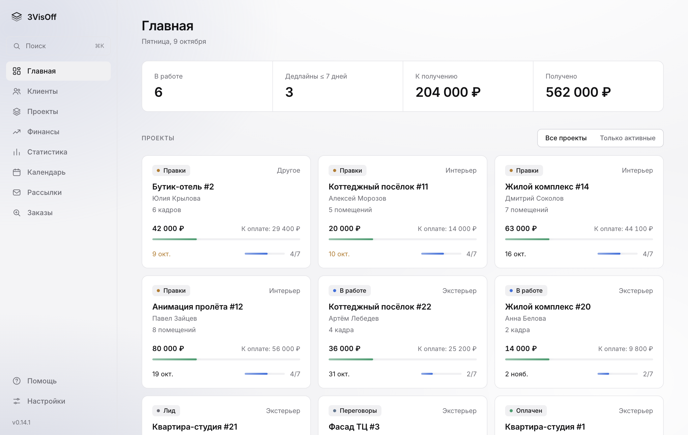
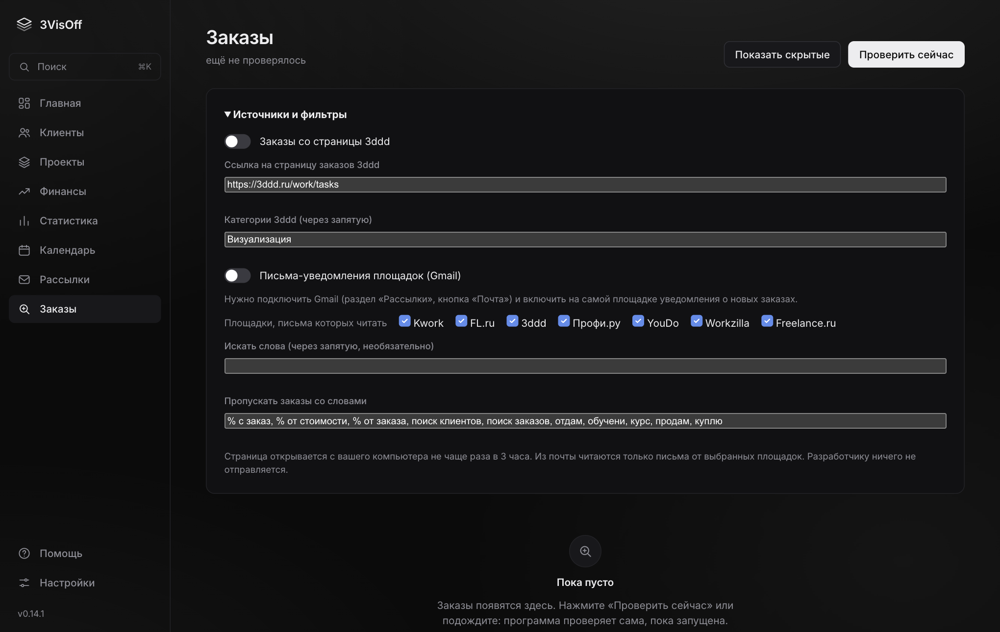

<div align="center">



# 3VisOff

**Органайзер для 3D-визуализатора: проекты, клиенты, расчёт цены, счета и акты, финансы и налоги в одной программе.**
Все данные хранятся только на вашем компьютере.

[](https://github.com/AdeptVision3D/3VisOff-releases/releases/latest)


### [⬇️ Скачать последнюю версию](https://github.com/AdeptVision3D/3VisOff-releases/releases/latest)

[Возможности](#возможности) · [Установка](#установка) · [PRO и цены](#pro-и-цены) · [Приватность](#приватность) · [Поддержка](#поддержка) · [English](#english)

</div>

<br>

<p align="center">
  
</p>

## Возможности

<table>
<tr>
<td width="50%" valign="top">

### 📋 Проекты и клиенты
Статусы от «Лид» до «Оплачен», сроки, прогресс этапов, оплаты по каждому проекту. Сразу видно, что в работе, что просрочено и сколько ещё должны.

</td>
<td width="50%" valign="top">

### 💰 Расчёт цены
Экстерьер: кадры × цена. Интерьер: помещения по площади. Срочность, скидка или наценка, платные правки сверх бесплатных кругов. Итог записывается в проект одной кнопкой.

</td>
</tr>
<tr>
<td valign="top">

### 🧾 Документы
Счёт в PDF бесплатно. Акт и договор с автоподстановкой данных клиента, свои шаблоны, история документов (PRO).

</td>
<td valign="top">

### 📈 Финансы и налоги
Доходы и расходы, статистика по месяцам и клиентам, оценка налога самозанятого, обязательства и напоминания, когда платить.

</td>
</tr>
<tr>
<td valign="top">

### 📅 Календарь
Дедлайны проектов, платежи и события в одном месте.

</td>
<td valign="top">

### 🔒 Безопасность
PIN-код, код восстановления, автоматические резервные копии, тёмная, светлая и чёрно-белая темы, русский и английский интерфейс.

</td>
</tr>
</table>

<p align="center">
  
  
</p>
<p align="center">
  
  
</p>
<p align="center">
  
  
</p>

### Что даёт PRO

| Функция | Что делает |
|---|---|
| Акт и договор | Данные проекта и клиента подставляются сами, мастер договора, история, свои шаблоны |
| Отправка по почте | Счёт, акт и договор уходят клиенту прямо из программы с вашей почты Gmail |
| Реквизиты по ИНН | Название, адрес и руководитель организации подставляются по номеру ИНН |
| QR-код оплаты и выписка | QR в счёте для оплаты в приложении банка, импорт доходов из банковской выписки |
| Документы с брендом | Ваш логотип и цвета в счёте, акте и договоре |
| Уведомления в Telegram | Напоминания об оплатах и событиях приходят на телефон (через вашего собственного бота) |
| Рассылки | Холодные рассылки по списку компаний с вашей почты, уведомления об ответах |
| **Заказы** | Заказы со страницы 3ddd и из писем-уведомлений бирж в вашей почте собираются в один список, мусор убирается |
| Синхронизация | Одни и те же данные на нескольких компьютерах через облачную папку |

<p align="center">
  
</p>

## PRO и цены

Базовая версия **бесплатна** и остаётся такой. PRO подключается ключом (интернет для проверки ключа не нужен).

| Срок | Цена | В месяц |
|---|---|---|
| 30 дней | **650 ₽** | 650 ₽ |
| 90 дней | **1 590 ₽** | ≈ 530 ₽ |
| 180 дней | **2 690 ₽** | ≈ 450 ₽ |

Можно попросить **пробный ключ на 7 дней** с частью функций PRO. Купить ключ или получить пробный: бот поддержки [@visoff_support_bot](https://t.me/visoff_support_bot).

## Установка

### Windows

1. Скачайте `3VisOff-Setup-….exe` из блока **Assets** [последнего релиза](https://github.com/AdeptVision3D/3VisOff-releases/releases/latest) и запустите.
2. Windows может показать предупреждение «Неизвестный издатель» (у программы пока нет цифровой подписи). Нажмите **«Подробнее»**, затем **«Выполнить в любом случае»**.
3. Обновления приходят сами: программа предложит обновиться, данные сохраняются.

### macOS (Apple Silicon: M1, M2, M3 и новее)

Программа пока без подписи Apple, поэтому при первой установке macOS предупреждает, что не знает разработчика. Это нормально: нужно один раз разрешить запуск.

1. Скачайте `3VisOff-…-arm64.dmg` из блока **Assets** [последнего релиза](https://github.com/AdeptVision3D/3VisOff-releases/releases/latest).
2. Откройте файл и перетащите **3VisOff** в папку **«Программы»**, затем извлеките установщик (⏏ в Finder).
3. Откройте **Терминал** (`⌘ Пробел`, «Терминал», Enter), вставьте команду и нажмите Enter:

```bash
xattr -cr /Applications/3VisOff.app
```

   Она ничего не покажет, это нормально: так macOS снимает пометку «скачано из интернета».
4. Откройте 3VisOff из «Программ». Готово.

<details>
<summary>Если не хочется использовать Терминал</summary>

1. Попробуйте открыть 3VisOff. macOS покажет предупреждение, нажмите «Готово».
2. Откройте **Системные настройки → Конфиденциальность и безопасность**, прокрутите вниз до сообщения про 3VisOff и нажмите **«Всё равно открыть»**. Подтвердите паролем или Touch ID.

</details>

### Обновления

Когда выходит новая версия, программа сама предложит обновиться: нажмите «Обновить», она скачает новую версию и перезапустится. Перед обновлением автоматически сохраняется резервная копия данных. Данные лежат в `~/Library/Application Support/3VisOff` (macOS) и не удаляются при переустановке.

## Приватность

Ваши клиенты, проекты, суммы и документы **не отправляются разработчику никогда**. Программа обращается к интернету только для проверки обновлений (GitHub) и для тех функций, которые вы включили сами (почта Gmail, ваш Telegram-бот, поиск реквизитов по ИНН, поиск заказов). Анонимная статистика и отчёты об ошибках выключены по умолчанию и отправляются только с вашего согласия.

Полный список, что и куда уходит: **[PRIVACY.md](PRIVACY.md)**. Он же есть в программе: Настройки → «Конфиденциальность и отчёты».

## Поддержка

- Вопросы, ключи PRO, пробный период, сообщения об ошибках: бот [@visoff_support_bot](https://t.me/visoff_support_bot).
- Внутри программы есть раздел **«Помощь»** с ответами на частые вопросы и кнопкой «Сообщить о проблеме».

---

## English

**3VisOff** is a desktop organizer for 3D visualizers (freelancers): projects and clients, price calculation (exterior shots, interior rooms by area, urgency, paid revisions), invoices, acts and contracts as PDF, finance and tax estimates for the self-employed, calendar, backups and PIN protection. The interface is available in Russian and English. **All data stays on your computer.**

- Free base version; PRO adds contracts and acts with auto-filled data, sending documents by email, payment QR codes, branded documents, outreach, order search and multi-device sync.
- Download: [latest release](https://github.com/AdeptVision3D/3VisOff-releases/releases/latest) (macOS Apple Silicon and Windows).
- macOS: the app is not yet signed by Apple; after installing run `xattr -cr /Applications/3VisOff.app` once, or use *System Settings → Privacy & Security → Open Anyway*.
- Privacy: see [PRIVACY.md](PRIVACY.md) (in Russian). Client and project data are never sent to the developer.
- Support: [@visoff_support_bot](https://t.me/visoff_support_bot) on Telegram.
